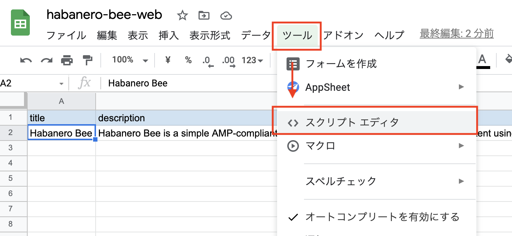
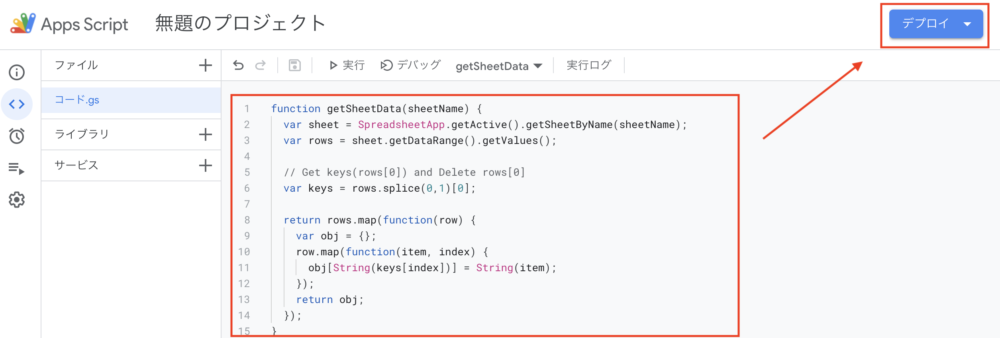
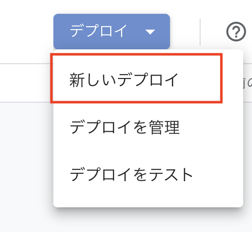
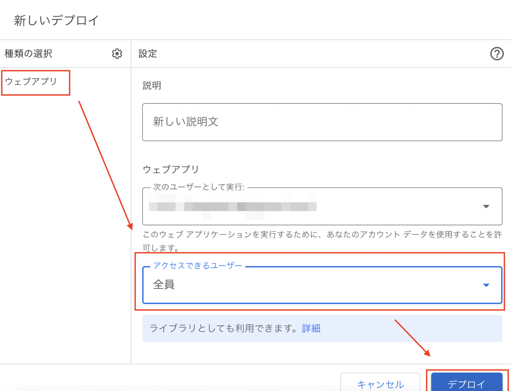
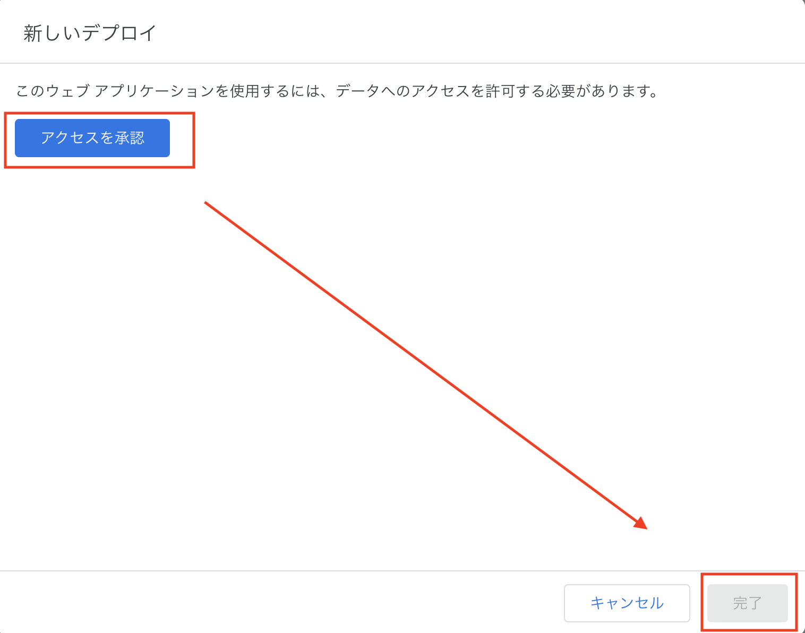
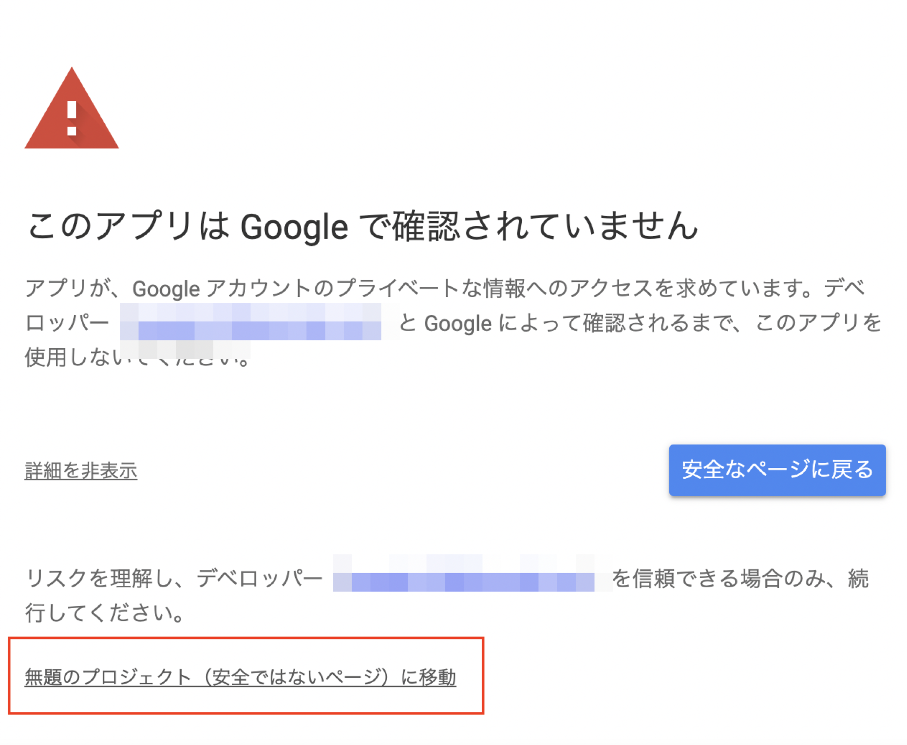
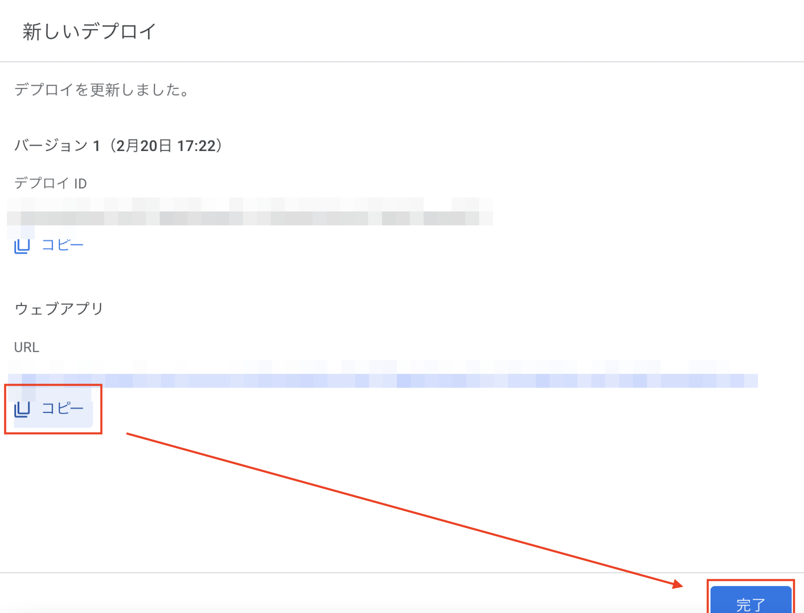

# habanero-bee-google-apps-script

これは [Habanero Bee](https://github.com/shinshin86/habanero-bee) というオープンソースのCMSソフトウェアで利用される、Google Apps Scriptです。

こちらのGoogle Apps Scriptをセットしてウェブアプリとしてデプロイすることで、Google スプレッドシートで管理している情報を [Habanero Bee](https://github.com/shinshin86/habanero-bee) から参照することが可能となります。

## 目次

* [Google スプレッドシートのセットアップ](#google-スプレッドシートのセットアップ)
  * [実際の作成例を見る](#実際の作成例を見る)
  * [シートの作成](#シートの作成)
    * [general](#general)
    * [meta](#meta)
    * [content](#content)
* [ウェブアプリとしてのリリース手順](#ウェブアプリとしてのリリース手順)
  * [1. Google スプレッドシートからスクリプトエディタを開く](#1-google-スプレッドシートからスクリプトエディタを開く)
  * [2. Google Apps Scriptを入力し、デプロイボタンを押す](#2-google-apps-scriptを入力しデプロイボタンを押す)
  * [3. 新しいデプロイを選択](#3-新しいデプロイを選択)
  * [4. 種類の選択で「ウェブアプリ」を選択し、アクセスできるユーザーを「全員」に設定します](#4-種類の選択でウェブアプリを選択しアクセスできるユーザーを全員に設定します)
  * [5. アクセスの承認を行い、完了を押す](#5-アクセスの承認を行い完了を押す)
  * [6. 承認を行う](#6-承認を行う)
  * [7. 生成されたURLをコピーして完了](#7-生成されたurlをコピーして完了)
* [Markdown記法](#markdown記法)
  * [YouTube埋め込み](#youtube埋め込み)
* [Licence](#licence)
* [Author](#author)


## Google スプレッドシートのセットアップ

これを利用するには、自分でGoogle スプレッドシートを設定する必要があります。
ここではその設定方法を説明します。

こちらに[Google スプレッドシートのテンプレート](https://docs.google.com/spreadsheets/d/e/2PACX-1vRbzmYKS3fUMynHxdG5mycdlOkO4y1trTyUXlRbGHE8qnnkZf5kWiaQv5x1rwEyCsisru-yfH4Te_XZ/pubhtml#)も用意しましたので、併せてご参照ください。

### 実際の作成例を見る

また、実際に[デモとして作成したGoogle スプレッドシートの例](https://docs.google.com/spreadsheets/d/e/2PACX-1vS9ygk_IU67huhAajNNOtbd17-r1HndsGnkDL5D7DHRK7cwHE-ALe0w2guVQD7b5pBQNe0sPJdLyF5h/pubhtml)もありますので、こちらもご参照ください。

こちらのスプレッドシートに`habanero-bee-google-apps-script` を適用してHabanero Beeで参照できるようにした[エンドポイントはこちら](https://script.google.com/macros/s/AKfycbzFMeY9SFDVuGj9n0t2UaS2NNcLws03xdQj1Gt-J_JSlPeqmhmupakjzU8nSbpcuFbJmw/exec)です。
(こちらにアクセスするとスプレッドシートに設定した内容がJSONとして返されます)

### シートの作成

下記の３つのシートを作成します。

* general
* meta
* content

そして、１列目にそれぞれ項目名を入力します。
項目名はこのあと説明します。

また、2列目には実際に表示する内容を追加します。
`general`と`meta`は2番目のカラムにのみ値を追加すればよいですが、
`content`については、表示したい分のコンテンツを追加してください。

#### general

* title
  * サイトのタイトル
* description
  * サイトの説明
* logoImage
  * サイトのロゴ画像
* logoImageAltText
  * サイトのロゴ画像のAltテキスト
* externalLinkUrl
  * 外部ページへのリンクがある場合は入力してください。また、カンマ区切りで複数のリンクを設定することが可能です。複数のリンクを設定する場合は、必ず下の`externalLinkText`も同じ順序で設定していく必要があります。
* externalLinkText
  * 外部ページへのリンクがある場合は、リンクに表示するテキストも入力してください。何も入力しない場合、デフォルトでは `Read` が表示されます。
* backgroundColor
  * 背景色を設定するオプションです。変更しない場合は入力する必要はありません。
* pageTopButtonColor
  * ページトップボタンの色を設定するオプションです。変更しない場合は入力する必要はありません。
* relatedContentTitle
  * 関連リンク項目に利用するタイトルテキストを指定します。指定がない場合は `Related Content` と表示されます。

#### meta

サイトのメタ情報を入力していきます。

* siteUrl
  * このサイトのURL
* title
  * サイトのタイトル
* description
  * サイトの説明
* keywords
  * サイトのキーワード(カンマ区切りで複数可)
* ogpImage
  * サイトのOGP画像として設定したい画像のURL
* googleAnalyticsTrackingId
  * Googleアナリティクスを設定したい方は入力してください。
* googleSiteVerificationCode
  * Googleアナリティクスを設定せずにGoogle Search Consoleだけを設定したい場合は、こちらで`Google Site Verification Code`を設定してください。
* noindex
  * 検索エンジンにインデックスさせたくない場合は、こちらの項目に`1`を入力してください。

#### content
コンテンツは必要な分だけ、行を追加して追加してください。
行の数だけ、ページが生成されます。

* title
  * ページのタイトル
* description
  * ページの説明
* text
  * ページの本文
    * markdownを使用することができます。ただし、SEOの観点から `#(h1 tag)` と `##(h2 tag)` を使用することは推奨されません。それらはページの枠組みで既に使用されているからです。
* imagePath
  * ページごとの画像URL
* imageAltText
  * ページごとの画像のAltテキスト
* slug
  * ページのslug(URL)
  * slugに `/` (スラッシュ) は使用できません。
* externalLinkUrl
  * 外部ページへのリンクがある場合は入力してください。また、カンマ区切りで複数のリンクを設定することが可能です。複数のリンクを設定する場合は、必ず下の`externalLinkText`も同じ順序で設定していく必要があります。
* externalLinkText
  * 外部ページへのリンクがある場合は、リンクに表示するテキストも入力してください。何も入力しない場合、デフォルトでは `Read` が表示されます。
* tags
  * ページのタグです。タグを設定すると、設定したタグのページも併せて生成されます。
  * タグはカンマで区切って入力してください。
  * タグに `/` (スラッシュ) は使用できません。
* publishedDate
  * コンテンツの公開日。こちらはオプションのため、公開日を指定しない場合は入力する必要はありません。
* dateFormat
  * `publishedDate`を指定した場合、日付のformatを指定できます。Googleスプレッドシート内のセレクトボックスから選択するか、独自のフォーマットを入力することも可能です。ただし指定できるのは年(YYYY)、月(MM)、日(DD)のみとなります。
  * 指定しない場合はデフォルトのフォーマットである`YYYY/MM/DD`が指定されます。


## ウェブアプリとしてのリリース手順

Google スプレッドシートのセットアップが完了したら、Google Apps Scriptの設定、ならびにウェブアプリとしてのリリースを行います。

これを行うことで、Habanero BeeからGoogle スプレッドシートのデータが参照できるようになります。

<font color="red">なお、この手順を行うことでGoogle スプレッドシートに記載したデータは外部から参照できるようになります。外部に漏れてほしくないデータがないかを、リリース前に再度ご確認ください。</font>


### 1. Google スプレッドシートからスクリプトエディタを開く




### 2. Google Apps Scriptを入力し、デプロイボタンを押す

[こちらに記載されているGoogle Apps Scriptのコード](https://raw.githubusercontent.com/shinshin86/habanero-bee-google-apps-script/main/habanero-bee-google-apps-script.gs)をキャプチャのようにエディタ内にコピーして保存してから、デプロイボタンを押してください。  
(コードのバージョンによっては、実際のコードの内容がキャプチャのものとは異なる場合があります。)




### 3. 新しいデプロイを選択



### 4. 種類の選択で「ウェブアプリ」を選択し、アクセスできるユーザーを「全員」に設定します

`アクセスできるユーザー` というところはデフォルトの状態にしてください。
(`自分(自身のメールアドレスがここに表示されています)` が選択されている状態となっています)



### 5. アクセスの承認を行い、完了を押す

アクセスの承認を押すと、承認するかどうかを尋ねられます。それについてはこの後の6で説明します。



### 6. 承認を行う

承認を行う際は、表示される画面に従うことで問題なく完了できますが、一点だけ分かりにくい箇所があるので、そちらについて説明します。

承認の際に下記のような画面が表示されますが、この画面が出たら、`詳細を表示`をボタンを押して画面下部のテキストをまずは表示させます。  
(最初、詳細を表示するまでは画面下部のテキストは表示されていません)

画面下部のテキストを表示させたら、`無題のプロジェクト(安全ではないページ)に移動` を選択して、移動した後の画面で画面に従って承認を行います。  
(画面内では`無題のプロジェクト` と表示されていますが、これは設定したプロジェクト名によって文言が異なります)



### 7. 生成されたURLをコピーして完了

生成されたウェブアプリのURLをコピーしてください。このURLは[Habanero Bee](https://github.com/shinshin86/habanero-bee)のリリース時に用いるURLとなりますので、メモ帳などに保存してください。

URLを保存したら、完了を押します。

お疲れさまです。これで [Habanero Bee](https://github.com/shinshin86/habanero-bee) からGoogleスプレッドシートの情報を参照するためのセットアップ作業は完了です。



## Markdown記法

ページの本文(`content.text`)にのみ、Markdownを使用できます。

対応している書き方については下記の通りです。  
(その他の書き方を行った場合、レイアウトが崩れるケースがあります)

```
### H3
```

### H3

```
#### H4
```

#### H4

```
##### H5
```

##### H5

```
###### H6
```

###### H6

※ Habanero Beeで生成されるページの構造上、 `# h1` と`# h2` を使用することは非推奨となっています。

```
* list1
* list2
  * nest list1
  * nest list2
```

- list1
- list2
  - nest list1
  - nest list2

Image

```

```


### YouTube埋め込み

ページの本文(`content.text`)にのみ、下記の記法でYouTube埋め込みを行うことが可能です。

```
`youtube:<YouTube URL>`
```

例:

```
`youtube:https://www.youtube.com/watch?v=gYJ03GyrSrM`
```

## Licence
[MIT](https://github.com/shinshin86/habanero-bee-google-apps-script/blob/main/LICENSE)

## Author
[Yuki Shindo](https://shinshin86.com)