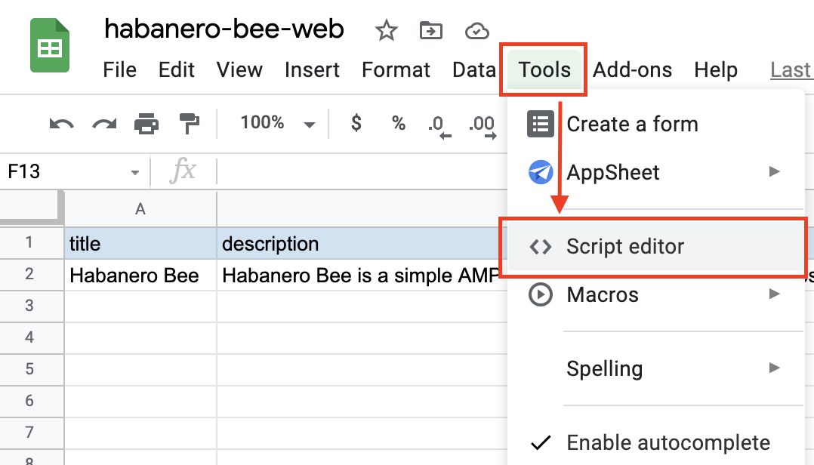
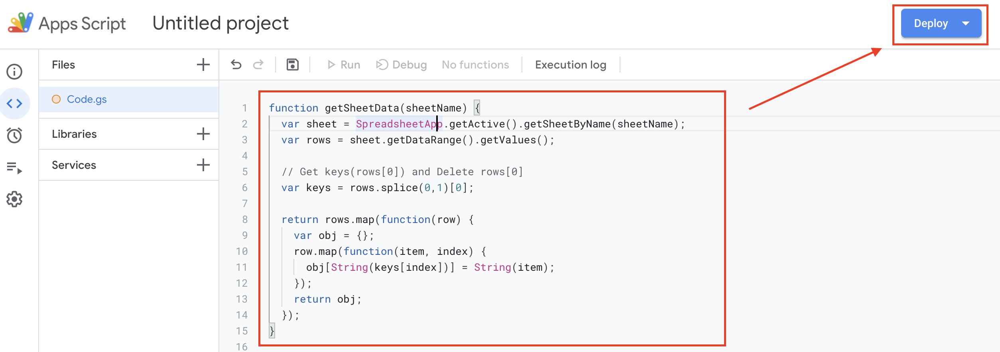
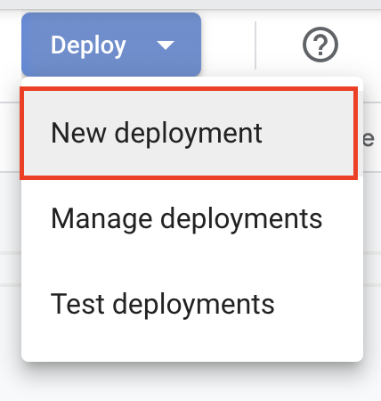
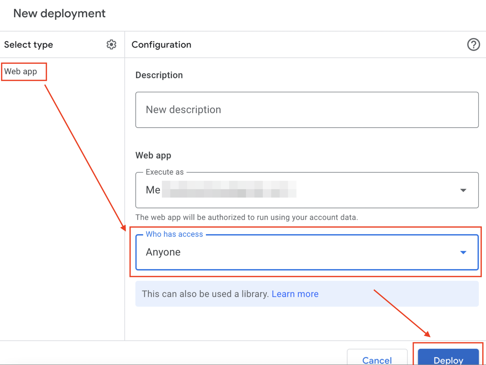
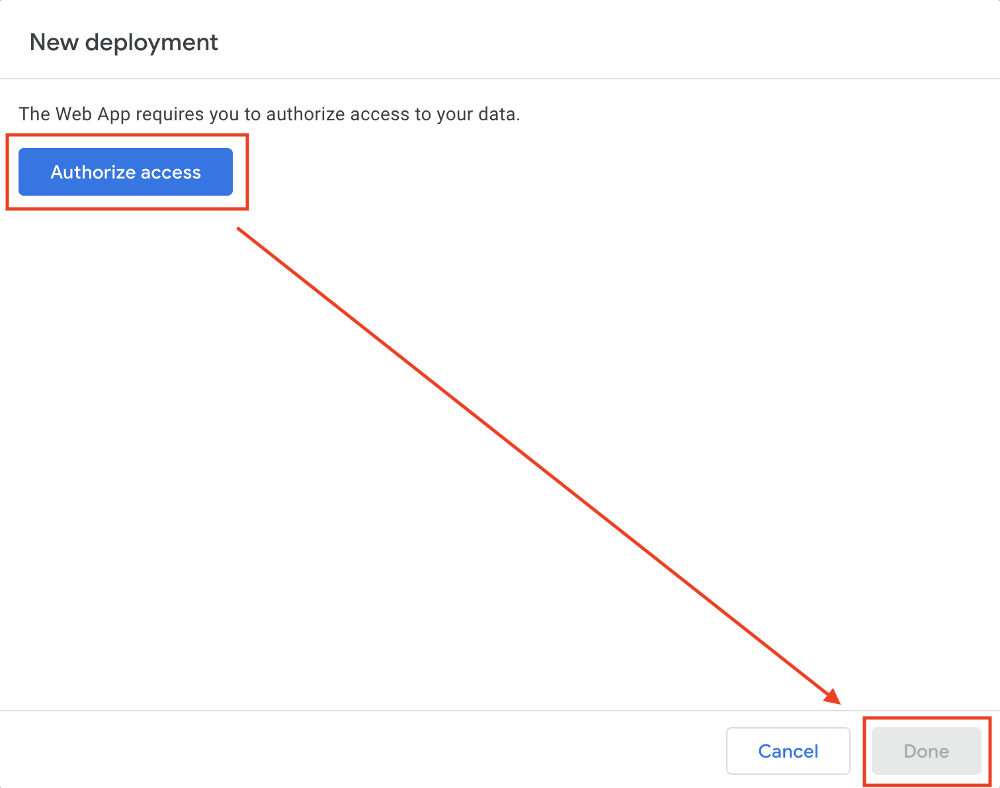
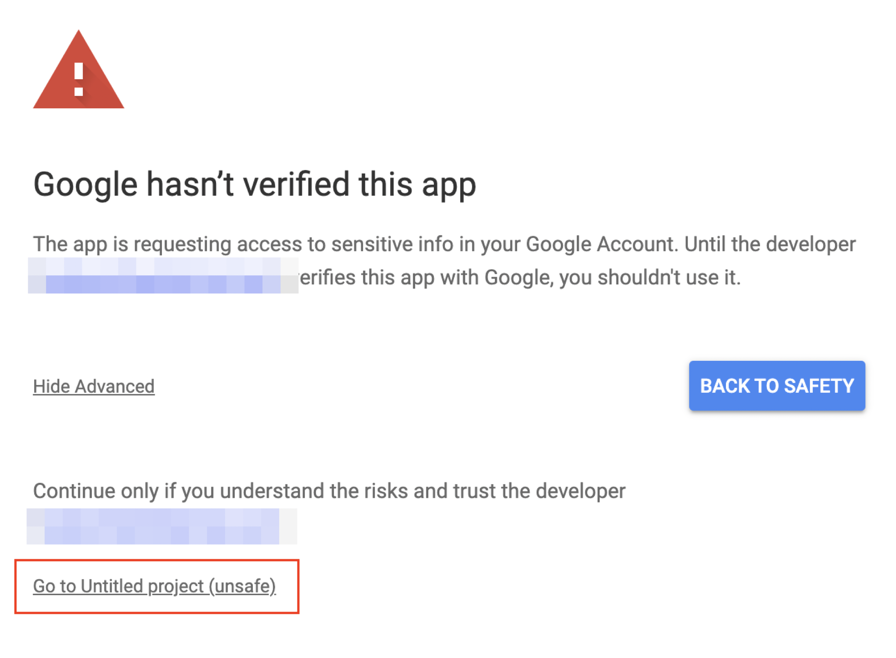
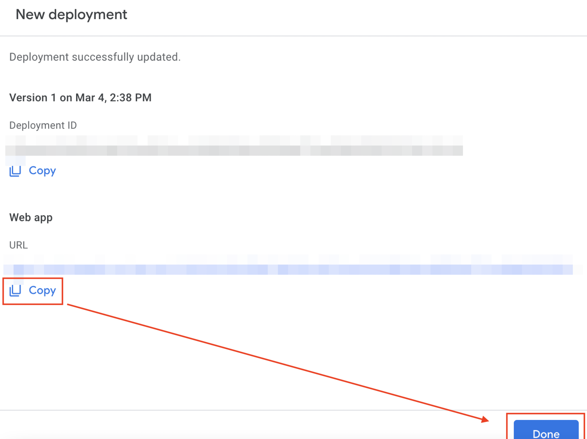

# habanero-bee-google-apps-script

This is Google Apps Script, which is used in an open source CMS software called [Habanero Bee](https://github.com/shinshin86/habanero-bee).

By setting this Google Apps Script and deploying it as a web app, you can refer to the information managed in Google Spreadsheet from [Habanero Bee](https://github.com/shinshin86/habanero-bee).

### READMEs for other languages are also available.

[日本語 README](./README.ja.md)

## Table of Contents

* [Setup Google Sheets](#setup-google-sheets)
  * [Example](#example)
  * [Create three sheets](#create-three-sheets)
    * [general](#general)
    * [meta](#meta)
    * [content](#content)
* [How to release](#how-to-release)
  * [1. Open the Script editor from Google Sheets](#1-open-the-script-editor-from-google-sheets)
  * [2. Enter the Google Apps Script and click the Deploy button.](#2-enter-the-google-apps-script-and-click-the-deploy-button)
  * [3. Select New deployment](#3-select-new-deployment)
  * [4. Select "Web app" for the type selection and set the accessible users to "Anyone".](#4-select-web-app-for-the-type-selection-and-set-the-accessible-users-to-anyone)
  * [5. Authorize access and press Done.](#5-authorize-access-and-press-done)
  * [6. Authorize access](#6-authorize-access)
  * [7. Copy generated URL and you're done.](#7-copy-generated-url-and-youre-done)
* [Support Markdown](#support-markdown)
  * [Embed YouTube](#embed-youtube)
* [Licence](#licence)
* [Authro](#author)

## Setup Google Sheets

To use this, you need to set up Google Sheets by yourself.
This section explains how to set it up.

I have also prepared a [Google Sheets template](https://docs.google.com/spreadsheets/d/e/2PACX-1vRbzmYKS3fUMynHxdG5mycdlOkO4y1trTyUXlRbGHE8qnnkZf5kWiaQv5x1rwEyCsisru-yfH4Te_XZ/pubhtml#) for you to use as well.

### Example

Also, there are some Google Sheets that I actually created as a demo, which you can refer to [here](https://docs.google.com/spreadsheets/d/e/2PACX-1vS9ygk_IU67huhAajNNOtbd17-r1HndsGnkDL5D7DHRK7cwHE-ALe0w2guVQD7b5pBQNe0sPJdLyF5h/pubhtml).

[Here's an endpoint](https://script.google.com/macros/s/AKfycbzFMeY9SFDVuGj9n0t2UaS2NNcLws03xdQj1Gt-J_JSlPeqmhmupakjzU8nSbpcuFbJmw/exec) that applies `habanero-bee-google-apps-script` to this spreadsheet so that it can be referenced by Habanero Bee.
(When you access this, the content you set up in Google Sheets will be returned as JSON.)

### Create three sheets

Create three sheets.

* general
* meta
* content

Then, enter the name of each item in the first column.
We will explain the item names later.

In the second column, add the actual content to be displayed.
For `general` and `meta`, you only need to add values to the second column, but for `content`, you need to add as much content as you want to display.

#### general

* title
  * Site title
* description
  * Site description
* logoImage
  * Site logo(Site image)
* logoImageAltText
  * Site logo alt text
* externalLinkUrl
  * If you have a link to an external page, please enter it. It is also possible to set multiple links separated by commas. If you set multiple links, you must make sure to set the `externalLinkText` below in the same order.
* externalLinkText
  * If you have a link to an external page, please enter the text of the link. If nothing is entered, it will be set to `Read` by default.
* backgroundColor
  * This is option of set background color. If you do not want to change it, you do not need to enter it.
* pageTopButtonColor
  * This is option of set page top button color. If you do not want to change it, you do not need to enter it.
* enableRelatedContentLink
  * If you want to show related links, enter `1` in this field.
* relatedContentTitle
  * Specifies the title text to be used for related link items. If not specified, it will be displayed as `Related Content`.
* externalLinkTitle
  * Specifies the title text to be used for external link items. If not specified, it will be displayed as `External link`.
* tagLinkTitle
  * Specify the title text to be used for tag. If not specified, it will be displayed as `Tag`.


#### meta

Enter the meta information for the site.

* siteUrl
  * URL of this site
* title
  * Title of this site
* description
  * Description of this site
* keywords
  * Keywords of this site
* ogpImage
  * URL of the image you want to set as the OGP image for your site.
* googleAnalyticsTrackingId
  * If you want to set up Google Analytics, please enter it.
* googleSiteVerificationCode
  * If you do not want to set up Google Analytics, but only Google Search Console, please set up a `Google Site Verification Code` here.
* noindex
  * If you do not want search engines to index your site, enter `1` in this field.

#### content

* title
  * A title for each page
* description
  * A description for each page
* text
  * A text for each page
    * You can use markdown. However, the use of `#(h1 tag)` and `##(h2 tag)` is not recommended for SEO reasons.
* imagePath
  * A image path(URL) for each page
* imageAltText
  * A image alt text for each page
* slug
  * A slug(URL) for each page
  * Can't use `/` (slash) in slug.
* externalLinkUrl
  * If you have a link to an external page, please enter it. It is also possible to set multiple links separated by commas. If you set multiple links, you must make sure to set the `externalLinkText` below in the same order.
* externalLinkText
  * If you have a link to an external page, please enter the text of the link. If nothing is entered, it will be set to `Read` by default.
* tags
  * A tags for each page. When you set a tag, the page for the tag you set will also be generated.
  * Please enter tags separated by commas.
  * Can't use `/` (slash) in tags.
* publishedDate
  * Publication date of the content. This is optional, so if you don't want to specify a publish date, you don't need to enter it.
* dateFormat
  * If you specify `publishedDate`, you can specify the format of the date, which can be selected from the select box in the Google Spreadsheet, or you can enter your own format. However, you can only specify the year (YYYY), month (MM), and day (DD).
  * If not specified, the default format `YYYY/MM/DD` will be used.

## How to release

Once the setup of Google Spreadsheet is complete, we will configure Google Apps Script and release it as a web app.

By doing this, you will be able to refer to the data of Google Spreadsheet from Habanero Bee.

<font color="red">Please note that by following this procedure, the data in the Google Spreadsheet will be available for external reference. Please check again before releasing to make sure that there is no data that you do not want leaked to the outside world.</font>


### 1. Open the Script editor from Google Sheets




### 2. Enter the Google Apps Script and click the Deploy button.

Copy the [Google Apps Script code exists here](https://raw.githubusercontent.com/shinshin86/habanero-bee-google-apps-script/main/habanero-bee-google-apps-script.gs) into the editor as shown in the capture, save it, and then click the Deploy button.  
(Depending on version of the code, actual content of code may differ from that of capture.)




### 3. Select New deployment



### 4. Select "Web app" for the type selection and set the accessible users to "Anyone".

The `Execute as` field should be set to its default state.
(`Me (my email address is shown here)` is selected)



### 5. Authorize access and press Done.

When you press `Authorize access`, you will be asked if you want to authorize access it. It will be explained in section 6 after this.



### 6. Authorize access

When authorize access, just follow the screen that appears and you should be good to go.
However, there is one part that is difficult to understand, so I will explain it here.

When you are approving, you will see a screen like the one below.  
(At first, the text at the bottom of the screen is not displayed until you show advanced.)

Once the text at the bottom of the screen is displayed, select `Go to Untitled project (unsafe)` and follow the on-screen instructions to approve the project after it is moved.  
(The text in the screen will say `Untitled project`, but the wording will vary depending on the project name you set).



### 7. Copy generated URL and you're done.

Please copy URL of generated web app. This URL will be used when [Habanero Bee](https://github.com/shinshin86/habanero-bee) is released, so please save it in Notepad or something.

After saving the URL, press Done.

Thank you for your time. This completes the release process necessary to reference the information in the [Google Sheets](https://github.com/shinshin86/habanero-bee) from Habanero Bee.



## Support Markdown

Markdown can be used only for the body of page (`content.text`).

The following is a list of supported writing styles.  
(If you use any other writing style, layout may be broken in some cases)

```
### H3
```

### H3

```
#### H4
```

#### H4

```
##### H5
```

##### H5

```
###### H6
```

###### H6

※ Due to structure of the page, `# h1` and `# h2` are not recommended to be used in Habanero Bee.

```
* list1
* list2
  * nest list1
  * nest list2
```

- list1
- list2
  - nest list1
  - nest list2

Image

```

```


### Embed YouTube

You can embed YouTube only in the body of page (`content.text`) using the following notation.

```
`youtube:<YouTube URL>`
```

Example:

```
`youtube:https://www.youtube.com/watch?v=gYJ03GyrSrM`
```

## Licence
[MIT](https://github.com/shinshin86/habanero-bee-google-apps-script/blob/main/LICENSE)

## Author
[Yuki Shindo](https://shinshin86.com)
