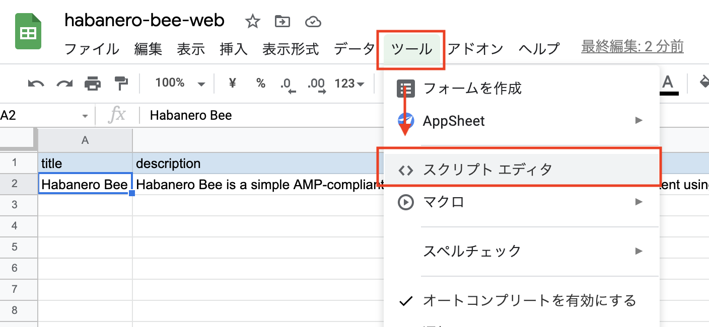
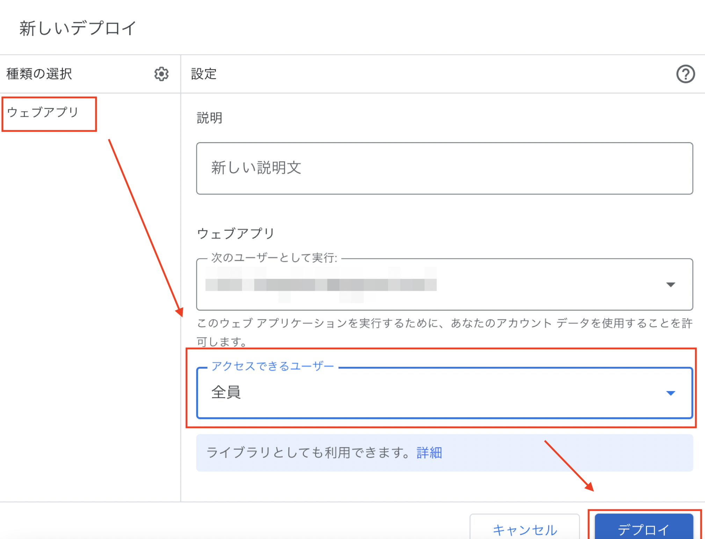
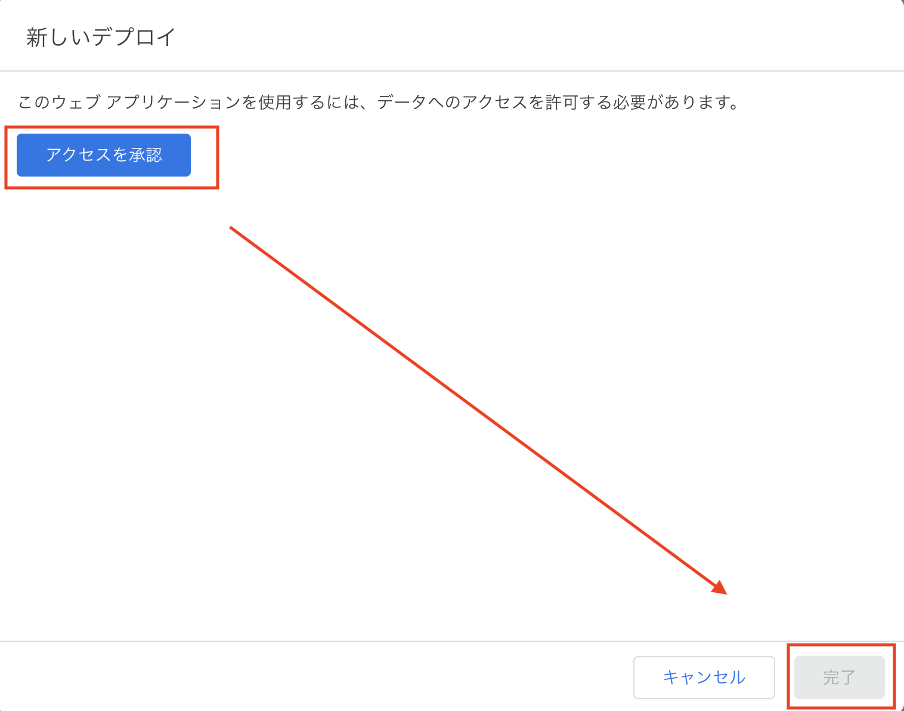

# habanero-bee-google-apps-script

This is Google Apps Script, which is used in an open source CMS software called [Habanero Bee](https://github.com/shinshin86/habanero-bee).

By setting this Google Apps Script and deploying it as a web app, you can refer to the information managed in Google Spreadsheet from [Habanero Bee](https://github.com/shinshin86/habanero-bee).

### READMEs for other languages are also available.

[日本語 README](./README.ja.md)

## Setup Google Sheets

To use this, you need to set up Google Sheets by yourself.
This section explains how to set it up.

### Create three sheets

Create three sheets.

* general
* meta
* content

Then, enter the name of each item in the first column.
We will explain the item names later.

In the second column, add the actual content to be displayed.
For `general` and `meta`, you only need to add values to the second column, but for `content`, you need to add as much content as you want to display.

#### general

* title
  * Site title
* description
  * Site description
* logoImage
  * Site logo(Site image)
* logoImageAltText
  * Site logo alt text
* websiteLink
  * If you have another site, please enter your site URL.
* twitterLink
* instagramLink
* facebookLink
* githubLink
* tumblrLink
* patreonLink
* quoraLink

#### meta

Enter the meta information for the site.

* siteUrl
  * URL of this site
* title
  * Title of this site
* description
  * Description of this site
* keywords
  * Keywords of this site
* ogpImage
  * URL of the image you want to set as the OGP image for your site.
* googleAnalyticsTrackingId
  * If you want to set up Google Analytics, please enter it.
* googleSiteVerificationCode
  * If you do not want to set up Google Analytics, but only Google Search Console, please set up a `Google Site Verification Code` here.

#### content

* title
  * A title for each page
* description
  * A description for each page
* text
  * A text for each page
    * You can use markdown. However, the use of `#(h1 tag)` and `##(h2 tag)` is not recommended for SEO reasons.
* imagePath
  * A image path(URL) for each page
* imageAltText
  * A image alt text for each page
* slug
  * A slug(URL) for each page
* externalLinkUrl
  * If you have a link to an external page, please enter it.
* externalLinkText
  * If you have a link to an external page, please enter the text of the link. If nothing is entered, it will be set to `Read` by default.
* tags
  * A tags for each page. When you set a tag, the page for the tag you set will also be generated.

## How to release

Once the setup of Google Spreadsheet is complete, we will configure Google Apps Script and release it as a web app.

By doing this, you will be able to refer to the data of Google Spreadsheet from Habanero Bee.

Please note that by following this procedure, the data in the Google Spreadsheet will be available for external reference. Please check again before releasing to make sure that there is no data that you do not want leaked to the outside world.

### 1. Open the Script Editor from Google Sheets

### 2. Enter the Google Apps Script and click the Deploy button.

Copy the [Google Apps Script code exists here](https://raw.githubusercontent.com/shinshin86/habanero-bee-google-apps-script/main/habanero-bee-google-apps-script.gs) into the editor as shown in the capture, and then click the Deploy button.

### 3. Select New Deployment

### 4. Select "Web App" for the type selection and set the accessible users to "All".

The `accessible users` field should be set to its default state.
(`Myself (my email address is shown here)` is selected)

### 5. Approve access and press Done.

When you press Approve Access, you will be asked if you want to approve it. It will be explained in section 6 after this.

### 6. Approve

When approving, just follow the screen that appears and you should be good to go.
However, there is one part that is difficult to understand, so I will explain it here.

When you are approving, you will see a screen like the one below.
(At first, the text at the bottom of the screen is not displayed until you show the details.)

Once the text at the bottom of the screen is displayed, select `Go to untitled project (insecure page)` and follow the on-screen instructions to approve the project after it is moved.
(The text in the screen will say `Untitled project`, but the wording will vary depending on the project name you set).

### 7. Copy the generated URL and you're done.

Please copy the URL of the generated web app. This URL will be used when [Habanero Bee](https://github.com/shinshin86/habanero-bee) is released, so please save it in Notepad or something.

After saving the URL, press Done.

Thank you for your time. This completes the release process necessary to reference the information in the [Google Sheets](https://github.com/shinshin86/habanero-bee) from Habanero Bee.

## Licence
[MIT](https://github.com/shinshin86/habanero-bee-google-apps-script/blob/main/LICENSE)

## Author
[Yuki Shindo](https://shinshin86.com)